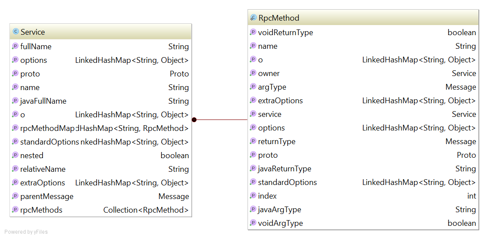

# Protostuff RPC Service Example

In many cases we want to define messages and services in the one place using one language.
This example shows how to do it in a simple way. 

Consider you have an input - proto file like this:
 
```proto
message SearchRequest {
    required string keyword = 1;
}

message SearchResponse {
    repeated string result = 1;
}

service SearchService {
    rpc search (SearchRequest) returns (SearchResponse);
}
```

The goal is to generate java code for messages and service interfaces.

## Project structure

In this example we use `protostuff-maven-plugin`.

There are three main components:

1. [search.proto](src/main/proto/search.proto) - contains message and service definitions
2. [service.java.stg](src/main/st/service.java.stg) - template for code generation (service only)
3. [pom.xml](pom.xml) - contains a configuration for `protostuff-maven-plugin`

## Service definition

You should use same syntax as for [protobuf compiler](https://developers.google.com/protocol-buffers/docs/proto#services).

Example:

```proto
service SearchService {
    rpc search (SearchRequest) returns (SearchResponse);
    rpc extendedSearch (ExtendedSearchRequest) returns (SearchResponse);
}

```

## Service code generation template

For basic protostuff code generation examples please check [this](https://code.google.com/p/protostuff/wiki/WritingCustomCodeGenerators).

In our [example](src/main/st/service.java.stg) we want to generate service interface that:

1. Returns [Guava's ListenableFuture&lt;T&gt;](https://code.google.com/p/guava-libraries/wiki/ListenableFutureExplained) as a method return type, where `T` is a service response message.
2. Takes single argument `U` - the service request message.

Rule `service_block` specifies how to render service interface/class. 

In the example we are using two service properties and some method properties:

Service properties:

Property      | Description
------------- | -------------
name          | Service name
rpcMethods    | Collection of `RpcMethod` definitions of this service

Service method properties:

Property      | Description
------------- | -------------
name          | Service method name
returnType    | Service method return type (message)
argType       | Service method argument type (message)

This diagram shows all properties that are accessible in this block:


## Maven plugin configuration

You can specify template for service code generation as an additional output of [protostuff-maven-plugin](https://github.com/kshchepanovskyi/protostuff-rpc-example/blob/master/pom.xml#L37):

```xml
 <source>src/main/proto/search.proto</source>
<outputDir>target/generated-sources</outputDir>
<output>
    java_bean,
    src/main/st/service.java.stg
</output>
```

This way you can use any template for your messages and custom template for services.

## Build instructions

As usually:

```
mvn clean install
```

After compilation you can go to `target/generated-sources` and examine generated code.